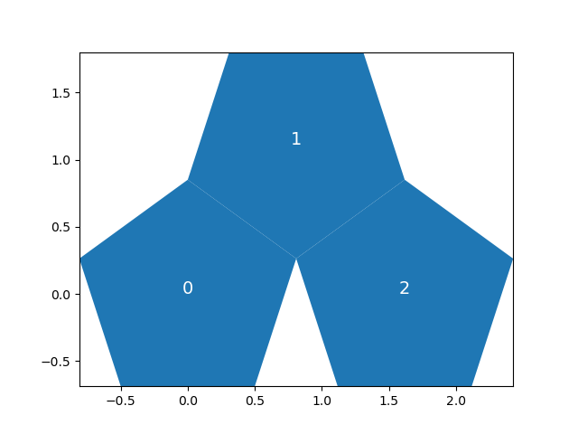
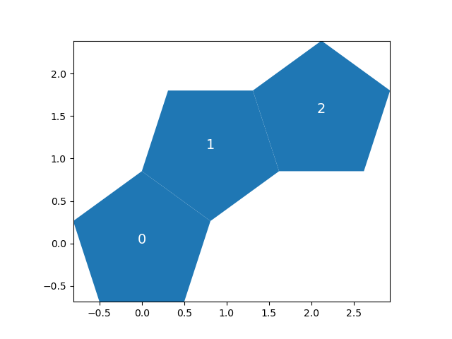

# Pent-up frustration 2
## Intro
This is my (accepted!) solution to the [Nov 2022 Jane Street Problem](https://www.janestreet.com/puzzles/pent-up-frustration-2-index/).

I tried a search-based approach, wich judging by the official solutions might have been the only way. 

## Strategy
In broad strokes, I first tried to reduce as much as possible the search space, and then looked for a solution within it. 

I divided the excercise in three parts

### 1. A priori reduction of the search space
While there are $5^{16}$ ways of creating chains of pentagons, quite a lot of them are obviously not worth trying. In particular:
- at the end of any chain, there are only 4 useful sides of a pentagon on which we can attach another one, as one is already taken. This brings us down to $4^{16}$ combinations
- there are only 2 sets of three pentagons worth exploring, all others are just the same, but turned/flipped around. This brings us down to $2*4^{14}$ combinations

  

This way we no longer have to try billions of combinations, but just a few million!

### 2. Exploration-based reduction of the search space

I look at all the combinations of 7 moves, to quickly get a sense of what moves are valid and invalid. This knowledge will then be useful to compose sequences in the futures

### 3. Looking for a solution
I try out all the plausible combinations of 16 moves. This is in itself divided in two:
1. Chain Generation - the sets of 16 moves are generated as one of the two possible set of two initial moves (see point 2. in the intro), followed by some combination of two of the valid sets of 7 moves (2+7+7 = 16)
2. Computing the minimum distance between pentagons - this is just a bit of high school maths

This now runs in under 4h on my laptop, so I've stopped here, but we could do significantly better.  
# Example solutions 
A few are stored in the solution folder, but here is one that I think looks nice. Of course, the minimum distance is the one between pentagons 0 and 16

